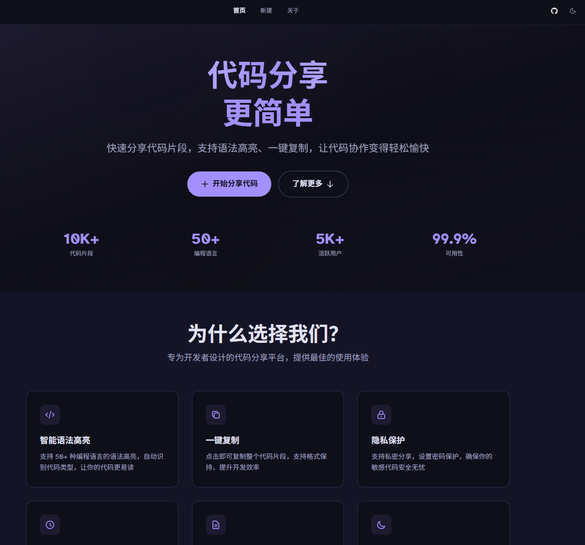
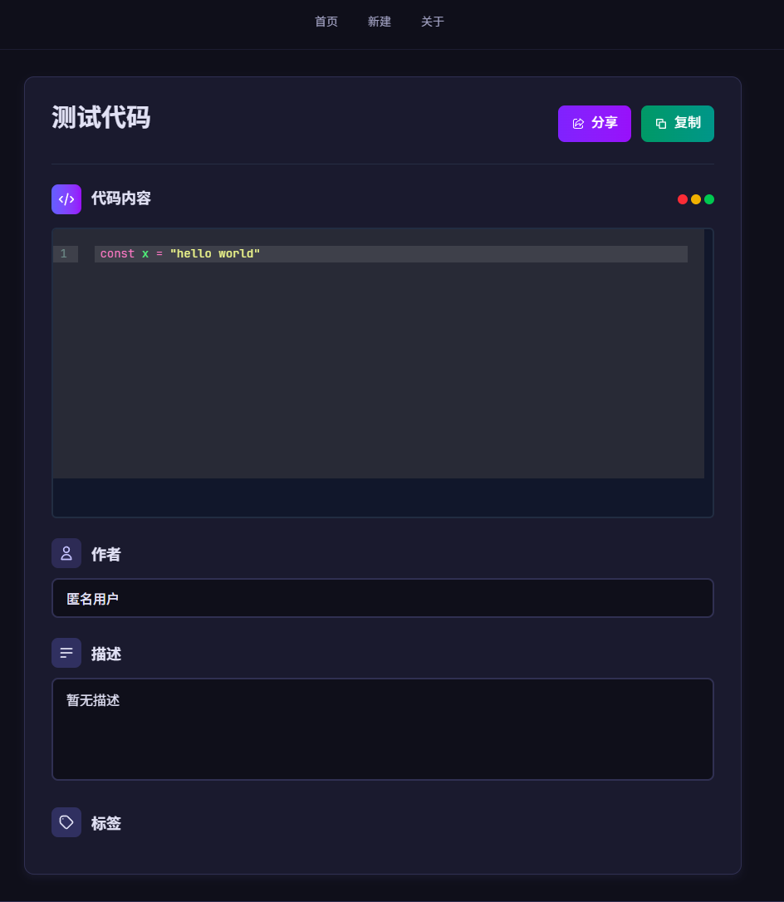

## 🧠 CodeShare - 代码分享平台

CodeShare 是一个支持访问密码、过期时间、代码高亮的在线代码分享平台，包含前后端完整实现。

---

## 📁 项目结构

```
├── frontend/           前端项目（Vue + CodeMirror + Tailwind）    
├── src/                后端服务（Rust）
```

---

## 🌐 前端

### 技术栈

| 类型   | 技术                                  |
| ------ | ------------------------------------- |
| 框架   | Vue Spa                               |
| 编辑器 | [CodeMirror 6]()                         |
| 样式   | [Tailwind CSS](https://tailwindcss.com/) |

### 快速开始

```shell
pnpm install
pnpm dev
```

### 特性

* 代码高亮与语言自动识别
* 密码保护与访问时效
* 移动端兼容与响应式布局
* 自定义 toast 提示系统
* 美观的 UI 设计，支持主题切换

---

## 🖥️ 后端

### 技术栈

| 类型     | 技术   |
| -------- | ------ |
| 语言     | Rust   |
| 数据库   | SQLite |
| 接口协议 | HTTP   |

### 快速开始

```shell
cargo run
```

默认端口：

* HTTP: `http://localhost:9000`

### 功能说明

* 创建代码片段（支持限时/限制访问）
* 访问分享（自动判断密码、时效）
* JSON API 支持
* 日志记录与错误处理

---

## docker 部署

```shell
docker-compose up -d
```

数据库保存在 `根目录/data`

可以使用nginx 反向代理9000 部署网站

## 🖼️ 项目截图

### 首页



### 创建分享页


### 预览页



---

## 📄 License

MIT

---
